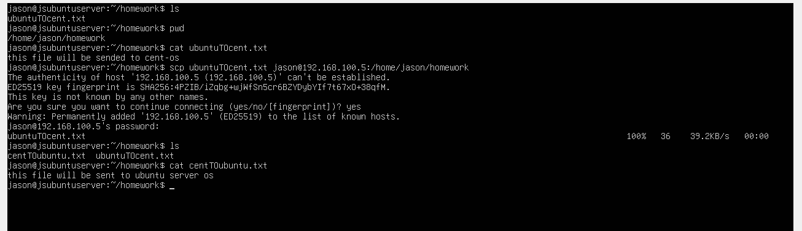

# - Midterm Portfolio-

## completed Assingments

##Chapter 1
Transferring files between virtual machines necessitates that these machines are situated within the same network, as demonstrated in the network configuration we provided.
We begin by verifying the connectivity between the machines using the "ping" command. First, from the Ubuntu server machine, we execute the command "ping 192.168.100.5" and confirm a successful connection to the other machine. Next, from the CentOS machine, we execute the command "ping 192.168.100.4" and again confirm a successful connection.

The "scp" (Secure Copy) command in Linux enables the secure transfer of files between a local and a remote host, or between two remote hosts, over an SSH (Secure Shell) connection. It ensures that files are transferred securely and encrypted.

To utilize the "scp" command effectively, certain steps must be followed. Initially, enter the command "scp," then specify the file by typing its name. Forward the file to a designated user on the target machine using the destination IP address. Select the directory where you want the file to be placed, and finally, enter the login password of the target user. Type "yes" to confirm, and the file will be transferred.

For instance, on the Ubuntu server machine, we created a file named "ubuntuTOcent.txt," and on the other machine, we created a file named "centTOubuntu.txt." Using the command: "scp ubuntuTOcent.txt Jason@192.168.100.5:/home/Jason/homework"

Command: "scp"
File: ubuntuTOcent.txt
User: Jason
IP: 192.168.100.5
Password: 12345
Folder destination: /home/Jason/homework

Similarly, executing the command "scp centTOubuntu.txt Jason@192.168.100.4:/home/Jason/homework" transfers the "centTOubuntu.txt" file.

Command: "scp"
File: centTOubuntu.txt
User: Jason
IP: 192.168.100.4
Password: 12345
Folder destination: /home/Jason/homework

The file transfer between both machines is successful, and the files are located in the directory /home/Jason/homework. The outcome depends on the accurate input provided on each machine.

Chapter 2
