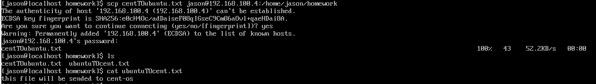

# - Midterm Portfolio-

## completed Assingments

1)
Transferring files between virtual machines necessitates that these machines are situated within the same network, as demonstrated in the network configuration we provided.
We begin by verifying the connectivity between the machines using the "ping" command. First, from the Ubuntu server machine, we execute the command "ping 192.168.100.5" and confirm a successful connection to the other machine. Next, from the CentOS machine, we execute the command "ping 192.168.100.4" and again confirm a successful connection.

The "scp" (Secure Copy) command in Linux enables the secure transfer of files between a local and a remote host, or between two remote hosts, over an SSH (Secure Shell) connection. It ensures that files are transferred securely and encrypted.

To utilize the "scp" command effectively, certain steps must be followed. Initially, enter the command "scp," then specify the file by typing its name. Forward the file to a designated user on the target machine using the destination IP address. Select the directory where you want the file to be placed, and finally, enter the login password of the target user. Type "yes" to confirm, and the file will be transferred.

For instance, on the Ubuntu server machine, we created a file named "ubuntuTOcent.txt," and on the other machine, we created a file named "centTOubuntu.txt." Using the command: "scp ubuntuTOcent.txt Jason@192.168.100.5:/home/Jason/homework"

Command: "scp"
File: ubuntuTOcent.txt
User: Jason
IP: 192.168.100.5
Password: 12345
Folder destination: /home/Jason/homework

Similarly, executing the command "scp centTOubuntu.txt Jason@192.168.100.4:/home/Jason/homework" transfers the "centTOubuntu.txt" file.

Command: "scp"
File: centTOubuntu.txt
User: Jason
IP: 192.168.100.4
Password: 12345
Folder destination: /home/Jason/homework

The file transfer between both machines is successful, and the files are located in the directory /home/Jason/homework. The outcome depends on the accurate input provided on each machine.

2)
To Print all lines where birthdays are in the year 1935, we use the following Grep command.
grep “/35” GrepLab.
grep: command 
“/35”: using this pattern input we can locate the individual whose birthdays are in the year 1935. 
GrepLab: the file where the command is issued.

3)
To Print the first name and first letter of the last name, and average contribution of those who had an average contribution of more then $300 we enter the following awk code
Awk -F: ‘{
Split($1, name, “ “);
Sum = $3 + $4 + $5;
Count++;
line_sums[count]  =  sum;
first_names[count]  = name[1];

lastName = name[length(name)];

first_letters[count] = substr(lastName, 1, 1);
}
END {
If (count > 0) {
For (i = 1; I <= count; i++) {
Average = line_sums[i] /3;
If (average > 300) {

##Printf “%s %s $%.2f\n” , first_names[i], first_letters[i], average;
}
}
}
}’ AwkLab.data
   awk: pattern scanning and text-processing tool 
-F ":": This option sets the field separator to ":". AWK will use this separator to split each input line into fields.
split($1, name, " "): This function splits the first field “$1” of the input line using a space (" ") as the separator and stores the result in the array name.
 sum = $3 + $4 + $5;: This calculates the sum of the third, fourth, and fifth fields and assigns it to the variable sum.
count++;: This increments the variable count by 1, indicating the number of lines processed.
line_sums[count] = sum;: This stores the sum of the numbers from fields 3, 4, and 5 in the array line_sums at the index count.
first_names[count] = name[1];: This stores the first name in the array first_names at the index count.
lastName = name[length(name)];: This retrieves the last name from the name array.
first_letters[count] = substr(lastName, 1, 1);: This extracts the first letter of the last name and stores it in the array first_letters.
The END block processes after all lines have been read. It checks if there is data to process (count > 0).
The for loop iterates over each line processed.
average = line_sums[i] / 3;: This calculates the average of the sum stored in line_sums.

 if (average > 300) { printf "%s %s $%.2f\n", first_names[i], first_letters[i], average; }: If the average is greater than 300, it prints the first name ”%s” , the first letter of the last name “%s” , and the average in the specified format “$%.2f\n”.
AwkLab.data: This is the input file that awk is processing.

